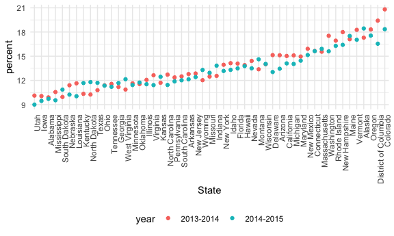
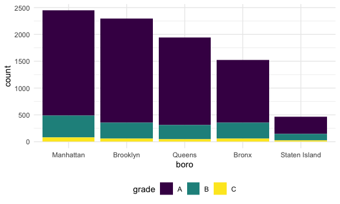

Strings and Factors
================

``` r
library(rvest)
```

    ## 
    ## Attaching package: 'rvest'

    ## The following object is masked from 'package:readr':
    ## 
    ##     guess_encoding

``` r
library(p8105.datasets)
```

## Strings and manipulations

``` r
string_vec = c("my", "name", "is", "vicky")

str_detect(string_vec, "vicky")
```

    ## [1] FALSE FALSE FALSE  TRUE

``` r
str_detect(string_vec, "y")
```

    ## [1]  TRUE FALSE FALSE  TRUE

``` r
str_detect(string_vec, "Vicky")
```

    ## [1] FALSE FALSE FALSE FALSE

``` r
str_replace(string_vec, "vicky", "Victoria Mello")
```

    ## [1] "my"             "name"           "is"             "Victoria Mello"

``` r
string_vec = c(
  "i think we all rule for participating",
  "i think i have been caught",
  "i think this will be quite fun actually",
  "it will be fun, i think"
  )

str_detect(string_vec, "i think")
```

    ## [1] TRUE TRUE TRUE TRUE

``` r
str_detect(string_vec, "^i think")
```

    ## [1]  TRUE  TRUE  TRUE FALSE

``` r
str_detect(string_vec, "i think$")
```

    ## [1] FALSE FALSE FALSE  TRUE

the ^ = at the beginning and the \$ = at the end

``` r
string_vec = c(
  "Time for a Pumpkin Spice Latte!",
  "went to the #pumpkinpatch last weekend",
  "Pumpkin Pie is obviously the best pie",
  "SMASHING PUMPKINS -- LIVE IN CONCERT!!"
  )

str_detect(string_vec,"Pumpkin")
```

    ## [1]  TRUE FALSE  TRUE FALSE

``` r
str_detect(string_vec,"[Pp]umpkin")
```

    ## [1]  TRUE  TRUE  TRUE FALSE

the \[Pp\] is how you make it look for both upper and lowercase

``` r
string_vec = c(
  '7th inning stretch',
  '1st half soon to begin. Texas won the toss.',
  'she is 5 feet 4 inches tall',
  '3AM - cant sleep :('
  )

str_detect(string_vec, "[0-9]")
```

    ## [1] TRUE TRUE TRUE TRUE

``` r
str_detect(string_vec, "^[0-9]")
```

    ## [1]  TRUE  TRUE FALSE  TRUE

``` r
str_detect(string_vec, "^[0-9][a-z]")
```

    ## [1]  TRUE  TRUE FALSE FALSE

``` r
string_vec = c(
  'Its 7:11 in the evening',
  'want to go to 7-11?',
  'my flight is AA711',
  'NetBios: scanning ip 203.167.114.66'
  )

str_detect(string_vec, "7.11")
```

    ## [1]  TRUE  TRUE FALSE  TRUE

the . allows you to look for 711 separated by ANY SYMBOL (but not if
theres no symbol)

``` r
string_vec = c(
  'The CI is [2, 5]',
  ':-]',
  ':-[',
  'I found the answer on pages [6-7]'
  )

str_detect(string_vec, "\\[")
```

    ## [1]  TRUE FALSE  TRUE  TRUE

indicate that the thing you are looking for is a ‘special character’
with a double backslash \\

## Factors

``` r
vec_sex = c("male", "male", "female", "female")
vec_sex
```

    ## [1] "male"   "male"   "female" "female"

``` r
as.numeric(vec_sex)
```

    ## Warning: NAs introduced by coercion

    ## [1] NA NA NA NA

``` r
vec_sex = fct_relevel(vec_sex, "male")
vec_sex
```

    ## [1] male   male   female female
    ## Levels: male female

``` r
as.numeric(vec_sex)
```

    ## [1] 1 1 2 2

## NSDUH

``` r
nsduh_url = "https://samhda.s3-us-gov-west-1.amazonaws.com/s3fs-public/field-uploads/2k15StateFiles/NSDUHsaeShortTermCHG2015.htm" 

table_marj = 
  read_html(nsduh_url) %>% 
  html_table() %>% 
  first() %>% 
  slice(-1)
```

–\> This is not a tidy dataset! We need to tidy this data imported from
web before working w it…

``` r
marj_df = 
  table_marj %>% 
  select(-contains("P Value")) %>% 
  pivot_longer(
      -State,
      names_to = "age_year",
      values_to = "percent"
  ) %>% 
  separate(age_year, into = c("age", "year"), "\\(") %>% 
   mutate(
    year = str_replace(year, "\\)", ""),
    percent = str_replace(percent, "[a-c]$", ""),
    percent = as.numeric(percent)) %>% 
  filter(!(State %in% c("Total U.S.", "Northeast", "Midwest", "South", "West")))

marj_df |>
  filter(age == "12-17") |> 
  mutate(State = fct_reorder(State, percent)) |> 
  ggplot(aes(x = State, y = percent, color = year)) + 
    geom_point() + 
    theme(axis.text.x = element_text(angle = 90, hjust = 1))
```



## NYC Resturant Inspections dataset

``` r
data("rest_inspec")
rest_inspec
```

    ## # A tibble: 397,584 × 18
    ##    action          boro  building  camis critical_flag cuisine_description dba  
    ##    <chr>           <chr> <chr>     <int> <chr>         <chr>               <chr>
    ##  1 Violations wer… MANH… 425      4.15e7 Not Critical  Italian             SPIN…
    ##  2 Violations wer… MANH… 37       4.12e7 Critical      Korean              SHIL…
    ##  3 Violations wer… MANH… 15       4.11e7 Not Critical  Café/Coffee/Tea    CITY…
    ##  4 Violations wer… MANH… 35       4.13e7 Critical      Korean              MADA…
    ##  5 Violations wer… MANH… 1271     5.00e7 Critical      American            THE …
    ##  6 Violations wer… MANH… 155      5.00e7 Not Critical  Donuts              DUNK…
    ##  7 Violations wer… MANH… 1164     5.00e7 Critical      Salads              SWEE…
    ##  8 Violations wer… MANH… 37       4.12e7 Not Critical  Korean              SHIL…
    ##  9 Violations wer… MANH… 299      5.01e7 Not Critical  American            PRET…
    ## 10 Violations wer… MANH… 53       4.04e7 Not Critical  Korean              HAN …
    ## # ℹ 397,574 more rows
    ## # ℹ 11 more variables: inspection_date <dttm>, inspection_type <chr>,
    ## #   phone <chr>, record_date <dttm>, score <int>, street <chr>,
    ## #   violation_code <chr>, violation_description <chr>, zipcode <int>,
    ## #   grade <chr>, grade_date <dttm>

``` r
rest_inspec |> 
  group_by(boro, grade) |> 
  summarize(n = n()) |> 
  pivot_wider(names_from = grade, values_from = n)
```

    ## `summarise()` has grouped output by 'boro'. You can override using the
    ## `.groups` argument.

    ## # A tibble: 6 × 8
    ## # Groups:   boro [6]
    ##   boro              A     B     C `Not Yet Graded`     P     Z  `NA`
    ##   <chr>         <int> <int> <int>            <int> <int> <int> <int>
    ## 1 BRONX         13688  2801   701              200   163   351 16833
    ## 2 BROOKLYN      37449  6651  1684              702   416   977 51930
    ## 3 MANHATTAN     61608 10532  2689              765   508  1237 80615
    ## 4 Missing           4    NA    NA               NA    NA    NA    13
    ## 5 QUEENS        35952  6492  1593              604   331   913 45816
    ## 6 STATEN ISLAND  5215   933   207               85    47   149  6730

``` r
rest_inspec =
  rest_inspec |>
  filter(grade %in% c("A", "B", "C"), boro != "Missing") |> 
  mutate(boro = str_to_title(boro))
```

Lets look at Pizza Places:

``` r
rest_inspec %>% 
  filter(str_detect(dba, "PIZZA")) %>% 
  count(boro)
```

    ## # A tibble: 5 × 2
    ##   boro              n
    ##   <chr>         <int>
    ## 1 Bronx          1519
    ## 2 Brooklyn       2299
    ## 3 Manhattan      2445
    ## 4 Queens         1937
    ## 5 Staten Island   466

``` r
rest_inspec %>% 
  filter(str_detect(dba, "PIZZA")) %>% 
  mutate(boro = fct_infreq(boro)) %>% 
  ggplot(aes(x = boro, fill = grade)) + 
  geom_bar()
```


–\> Jeff likes fct_reoder bc it says that you want the average for the
numeric variable to be the order they are in \*\* IF you wanted to do
something like rename Manhattan “The City” you would use
fct_recode(boro, “The City” = Manhattan))
